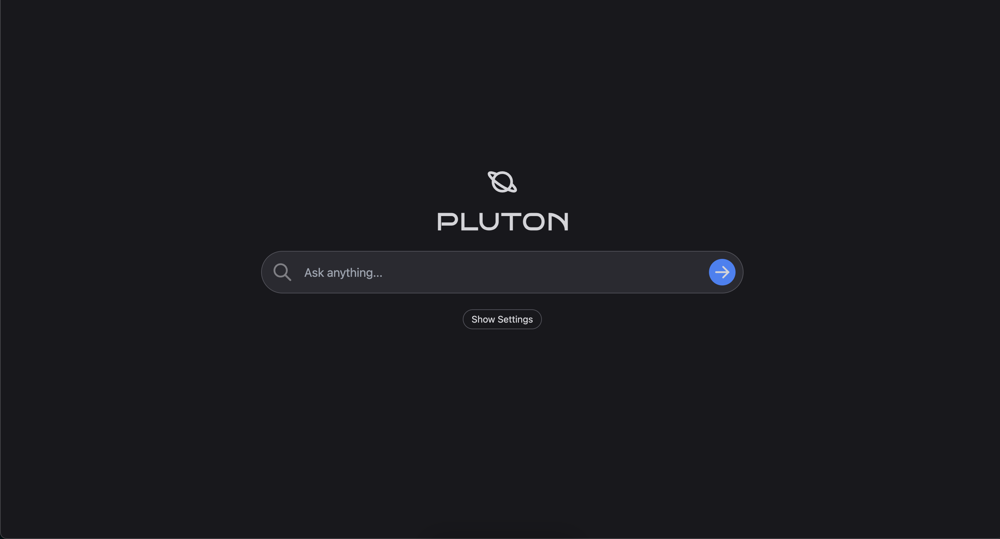

# Pluton

Pluton is simple [perplexity.ai](https://www.perplexity.ai/) clone. Use the code for whatever you like! :)

If you have any questions, feel free to reach out to me on [Twitter](https://twitter.com/vulovix).

[](https://pluton.rs/)

## How It Works

Given a query, Pluton fetches relevant, up-to-date information from the web and uses OpenAI's API to generate an answer.

The app works as follows:

1. Get query from user
2. Scrape Google for relevant webpages
3. Parse webpages for text
4. Build prompt using query + webpage text
5. Call OpenAI API to generate answer
6. Stream answer back to user

## Requirements

Get OpenAI API key [here](https://openai.com/api/).

## Running Locally

1. Clone repo

```bash
git clone https://github.com/vulovix/pluton.git
```

2. Install dependencies

```bash
npm i
```

3. Run app

```bash
npm run dev
```

## Improvement Ideas

Here are some ideas for how to improve Pluton:

- [ ] Speed up answers by replacing link scraping with the Google Search API (scraping was used to circumvent cost + rate limits)
- [ ] Add "follow up" searches
- [ ] Improve the prompt
- [ ] Train your own model to use for answer synthesis

## Credits

Shoutout to [Perplexity AI](https://www.perplexity.ai/) for the inspiration. I highly recommend checking their product out.

This repo is meant to show people that you can build powerful apps like Perplexity even if you don't have a large, experienced team.

LLMs are amazing, and I hope Pluton inspires you to build something cool!

## Resources

favicon: https://www.flaticon.com/free-icon/saturn_8681225
